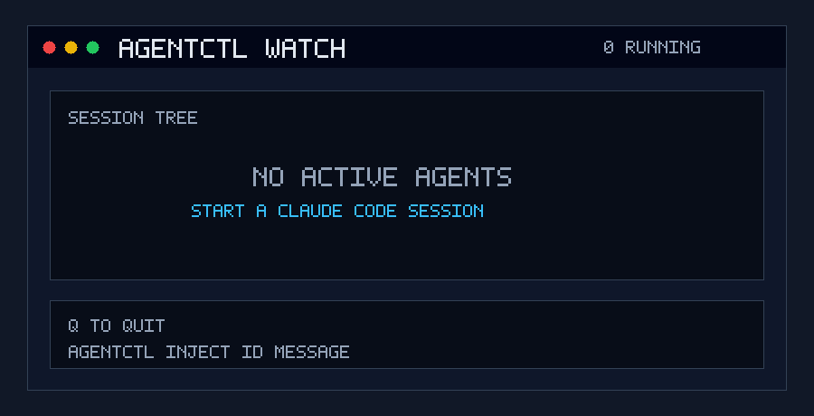

# agentctl

> Sub-agent control plane for Claude Code.  
> See what agents do. Steer them mid-run. Stop runaway loops.

---

## The problem

When Claude Code runs sub-agents, you have two options: watch a one-line terminal entry with no detail, or kill everything with `Ctrl+C` and lose all context. There is no middle ground.

```
MONITORING  →  ✅ Solved (893⭐ repos, native Channels from Anthropic)
CONTROL     →  ❌ Unsolved — agentctl lives here
```

## What it does

**Three capabilities, no more:**

```bash
# Inject a steering signal into a running agent
agentctl inject <agent-id> "Stop building auth. Use Supabase Auth instead."

# Cap an agent's token budget
agentctl cap <agent-id> --tokens 50000

# Kill one agent, not all of them
agentctl kill <agent-id>
```

## Demo



## Install

```bash
curl -fsSL https://raw.githubusercontent.com/IliasAlmerekov/agentctl/main/install.sh | bash
```

Installs binaries to `~/.agentctl/bin/`, patches `~/.claude/settings.json` with hooks, and registers the daemon as a background process (launchd on macOS, systemd on Linux).

## Usage

```bash
agentctl agents          # List all agents with token usage
agentctl watch           # Live TUI — agent tree, token bars, loop alerts
agentctl status          # Show daemon status
agentctl inject <id> "message"
agentctl cap <id> --tokens 50000
agentctl kill <id>
```

## How it works

Claude Code runs a hook script on every tool call. The hook calls the local daemon (`127.0.0.1:47823`) which decides whether to block, inject a message, or allow. The daemon tracks:

- **Loop detection** — same tool + same args called 5× in 2 minutes → blocked
- **Budget enforcement** — tokens_used ≥ token_budget → blocked with summary request
- **Injection queue** — pending steering signals delivered at the next tool call boundary

If the daemon is unreachable, hooks exit `0` — Claude is never blocked by agentctl being down.

## Local security model

agentctl is a single-user local control plane. The daemon binds only to IPv4 loopback (`127.0.0.1:47823`) and requires the local token from `~/.agentctl/auth-token` for CLI, TUI WebSocket, and hook requests.

This protects against unauthenticated local HTTP clients accidentally or opportunistically controlling agents through the daemon port. It does not protect against code already running as your user that can read files under your home directory, replace agentctl binaries, or edit Claude Code hook settings.

## Architecture

```
Claude Code (agent + sub-agents)
         │ tool calls
         ▼
   Hook scripts (.ts)          ← < 150ms per call
         │ HTTP POST 127.0.0.1:47823
         ▼
   agentctl daemon (Bun)
   ├── SQLite: agents.db
   ├── Loop detector
   ├── Budget manager
   ├── Injection queue
   └── WebSocket → TUI
```

## Development

Requires [Bun](https://bun.sh).

```bash
bun install
bun run dev:daemon      # daemon with hot reload
bun run typecheck       # type check
bun run build           # compile all binaries to dist/
```

## Stack

| Component | Choice | Reason |
|-----------|--------|--------|
| Runtime | Bun | Hook startup ~8ms vs Node ~180ms |
| Database | bun:sqlite | Native, WAL mode, no bindings |
| TUI | Ink (React for terminal) | Declarative, composable |
| CLI parser | commander | Lightweight, well-typed |
| Distribution | bun build --compile | Single binary, no runtime required |
